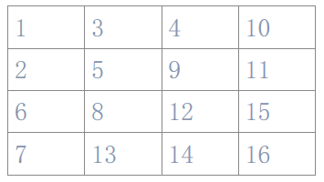

用户：
改一下排版  现在字体不统一 太乱了  按照四个章节  字符串 枚举递归  数据结构  数字 四个章节 每个章节🈶对应题目  给我改一下排版 文字内容不要改动
豆包：
# C语言算法题集
## 一、字符串操作类
### 题目1：字符串循环左移
题目描述：将字符串循环左移n位，例如输入"abcdef"、n=2，输出"cdefab"。

思路：采用三次反转法实现高效左移，无需额外空间：
1. 反转字符串前n个字符；
2. 反转字符串剩余部分；
3. 反转整个字符串。

可执行代码：
```c
#include <stdio.h>
#include <string.h>

// 反转字符串[start, end]区间（含边界）
void reverse(char *start, char *end) {
    while (start < end) {
        char temp = *start;
        *start = *end;
        *end = temp;
        start++;
        end--;
    }
}

// 三次反转法实现左移
void leftRotate2(char *s, int n) {
    if (s == NULL || *s == '\0') return;
    int len = strlen(s);
    
    reverse(s, s + n - 1);       // 1. 反转前n个字符
    reverse(s + n, s + len - 1); // 2. 反转剩余字符
    reverse(s, s + len - 1);     // 3. 反转整个字符串（核心步骤）
}

int main() {
    char s[] = "abcdef";
    int n = 2;
    leftRotate2(s, n);
    printf("左移%d位结果:%s\n", n, s); // 输出:cdefab
    return 0;
}
```

### 题目2：字符串替换（替换所有匹配项）
题目描述：输入长字符串、匹配字符串、替换字符串，将所有匹配项替换，例如输入"abcdd"、"bc"、"a"，输出"aadd"。

思路：指针扫描+循环替换：
1. 指针p从长字符串起始位置扫描；
2. 用strstr查找下一个匹配项位置；
3. 拼接“匹配前内容+替换字符串”，移动指针到匹配项后；
4. 所有匹配处理完后，拼接剩余未匹配内容。

可执行代码：
```c
#include <string.h>
#include <stdio.h>

int main() {
    char str[200], match[50], replace[50];
    char result[400] = {0}; // 初始化避免乱码
    char *p, *pos;
    int len_match, len_replace;

    printf("输入长字符串、匹配字符串、替换字符串（空格分隔）:\n");
    scanf("%s %s %s", str, match, replace);

    p = str;
    len_match = strlen(match);
    len_replace = strlen(replace);

    // 循环替换所有匹配项（核心逻辑）
    while ((pos = strstr(p, match)) != NULL) {
        strncat(result, p, pos - p); // 复制匹配前内容
        strcat(result, replace);     // 拼接替换字符串
        p = pos + len_match;        // 关键：移动指针到匹配项后，避免重复
    }
    strcat(result, p); // 拼接剩余未匹配内容

    printf("替换后:%s\n", result);
    return 0;
}
```

### 题目3：字符串按单词反序
题目描述：以空格分隔单词，反序输出单词，例如输入"I am here!"，输出"here! am I"。

思路：两次反转实现高效反序：
1. 反转整个字符串（单词顺序颠倒，单词内部逆序）；
2. 反转每个单词（恢复单词内部顺序）；
3. 跳过空格定位单词的起始/结束位置。

关键点：
- 两次反转逻辑：整体反转+局部反转，无需额外空间；
- 单词边界定位：通过跳过空格找到每个单词的首尾；
- 自定义长度计算：适配含特殊字符的字符串。

可执行代码：
```c
#include <stdio.h>

// 计算字符串长度
int strLength(char *str) {
    int len = 0;
    while (str[len] != '\0') len++;
    return len;
}

// 反转字符串[start, end]区间
void reverseSegment(char *str, int start, int end) {
    while (start < end) {
        char temp = str[start];
        str[start] = str[end];
        str[end] = temp;
        start++;
        end--;
    }
}

// 单词反序核心函数
void reverseWords(char *str) {
    int len = strLength(str);
    reverseSegment(str, 0, len - 1); // 1. 先反转整个字符串（关键步骤）

    int i = 0, j;
    // 2. 再反转每个单词（核心循环）
    while (i < len) {
        while (i < len && str[i] == ' ') i++; // 跳过空格找单词起始
        if (i >= len) break;
        j = i;
        while (j < len && str[j] != ' ') j++; // 找单词结束
        reverseSegment(str, i, j - 1);        // 反转当前单词
        i = j; // 移动到下一个单词
    }
}

int main() {
    char str[100];
    printf("输入字符串（支持空格）:\n");
    // 逐字符读取，支持空格输入
    int i = 0;
    char c;
    while ((c = getchar()) != '\n' && c != EOF) str[i++] = c;
    str[i] = '\0'; // 手动添加结束符

    reverseWords(str);
    printf("单词反序后:%s\n", str);
    return 0;
}
```

### 题目4：两字符串交替合并
题目描述：按"st1[0]+st2[0]+st1[1]+st2[1]..."合并，短字符串结束后追加剩余部分。

思路：双指针同步遍历：
1. 三个指针分别指向st1、st2、结果st3；
2. 交替取两字符串字符存入st3；
3. 追加较长字符串的剩余部分。

关键点：
- 双指针同步移动：确保交替顺序正确；
- 结果数组初始化：避免默认值导致乱码；
- 手动添加结束符：确保输出正常。

可执行代码：
```c
#include <stdio.h>
#include <string.h>

int main() {
    char str1[100] = {0}, str2[100] = {0}, str3[200] = {0};
    printf("输入两个字符串（空格分隔）:\n");
    scanf("%s %s", str1, str2);

    int i = 0, j = 0, k = 0;
    // 交替取字符（核心循环）
    while (str1[i] != '\0' && str2[j] != '\0') {
        str3[k++] = str1[i++];
        str3[k++] = str2[j++];
    }
    // 追加str1剩余字符
    while (str1[i] != '\0') str3[k++] = str1[i++];
    // 追加str2剩余字符
    while (str2[j] != '\0') str3[k++] = str2[j++];
    str3[k] = '\0'; // 关键：手动添加结束符

    printf("交替合并后:%s\n", str3);
    return 0;
}
```

### 题目5：字符串中连续数字转整数（分组5位）
题目描述：将字符串中连续数字转整数，超过5位按5位分组，结果存入数组，返回个数。例如输入"a123bc451786#96def123456789"，输出[123,45,786,96,12345,6789]。

思路：遍历字符串+积累数字：
1. 初始化累加变量、连续长度计数器、数组计数；
2. 数字字符则累加计算，长度+1；
3. 长度达5位或遇非数字时，存储整数并重置；
4. 处理末尾剩余数字。

关键点：
- 数字转换：通过*s - '0'将字符转为数值；
- 分组控制：长度达5位立即存储，避免超范围；
- 末尾处理：遍历结束后检查未存储的数字。

可执行代码：
```c
#include <stdio.h>
#include <ctype.h> // isdigit函数（常见库）

// 数字转整数核心函数
int jishu(char *s, int a[]) {
    int count = 0;    // 数组中整数个数
    int num = 0;      // 临时累加数字
    int digitLen = 0; // 连续数字长度

    // 遍历字符串（核心循环）
    while (*s != '\0') {
        if (isdigit(*s)) { // 判断是否为数字
            num = num * 10 + (*s - '0'); // 关键：数字累加计算
            digitLen++;
            // 长度达5位，存储并重置
            if (digitLen == 5) {
                a[count++] = num;
                num = 0;
                digitLen = 0;
            }
        } else {
            // 遇非数字且有积累，存储并重置
            if (digitLen > 0) {
                a[count++] = num;
                num = 0;
                digitLen = 0;
            }
        }
        s++;
    }
    if (digitLen > 0) a[count++] = num; // 关键：处理末尾剩余数字

    return count;
}

int main() {
    char s[] = "a123bc451786#96def123456789";
    int a[20] = {0};
    int len = jishu(s, a);

    printf("转换后数组：");
    for (int i = 0; i < len; i++) printf("%d ", a[i]); // 输出目标结果
    printf("\n整数个数：%d\n", len); // 输出：6
    return 0;
}
```

### 题目6：字符串合并并删除空格
题目描述：输入两个字符串，合并后删除所有空格，输出结果。例如输入"hello world"、"test 123"，输出"helloworldtest123"。

思路：先合并字符串，再遍历删除空格：
1. 合并两个字符串（用strcat）；
2. 遍历合并后的字符串，跳过空格，复制到结果数组；
3. 手动添加结果数组的结束符。

关键点：
- 空格判断：通过str[i] != ' '筛选非空格字符；
- 结果数组长度：预留足够空间（两字符串长度之和）；
- 结束符处理：确保结果是合法字符串。

可执行代码：
```c
#include <stdio.h>
#include <string.h>

int main() {
    char str1[100], str2[100], merged[200] = {0}, result[200] = {0};
    int i = 0, k = 0;

    // 读取两个字符串（支持含空格的读取）
    printf("输入第一个字符串（支持空格）:\n");
    fgets(str1, sizeof(str1), stdin);
    str1[strcspn(str1, "\n")] = '\0'; // 去除fgets的换行符
    printf("输入第二个字符串（支持空格）:\n");
    fgets(str2, sizeof(str2), stdin);
    str2[strcspn(str2, "\n")] = '\0';

    // 1. 合并两个字符串
    strcat(merged, str1);
    strcat(merged, str2);

    // 2. 删除空格（核心循环）
    while (merged[i] != '\0') {
        if (merged[i] != ' ') { // 跳过空格
            result[k++] = merged[i];
        }
        i++;
    }
    result[k] = '\0'; // 关键：添加结束符

    printf("合并并删除空格后:%s\n", result);
    return 0;
}
```

### 题目7：删除字符串重复字符并记录个数
题目描述：输入字母字符串，删除重复字符，在首次出现位置后记录删除个数。例如输入"abbcddd"，输出"ab1cd2"。

思路：标记字符出现状态+统计重复次数：
1. 用数组isUsed标记字符是否已出现（字母共26个，索引对应'a'-'z'）；
2. 遍历字符串，未出现的字符直接存入结果，标记为已用；
3. 已出现的字符则累加重复次数；
4. 遇到新字符时，先输出前一个字符的重复次数（若有），再存新字符。

关键点：
- 字符标记：用26位数组高效判断重复（避免嵌套循环）；
- 次数统计：单独变量记录当前字符的重复次数；
- 结果拼接：区分“首次出现字符”和“重复字符”的处理逻辑。

可执行代码：
```c
#include <stdio.h>
#include <string.h>
#include <ctype.h> // isalpha函数

int main() {
    char str[100], result[200] = {0};
    int isUsed[26] = {0}; // 标记a-z是否已出现（0未出现，1已出现）
    int i = 0, k = 0, repeat = 0; // repeat：当前字符的重复次数

    printf("输入字母字符串:\n");
    scanf("%s", str);

    // 遍历字符串（核心逻辑）
    while (str[i] != '\0') {
        if (!isalpha(str[i])) { // 仅处理字母（题目要求输入字母串）
            i++;
            continue;
        }
        int idx = tolower(str[i]) - 'a'; // 统一转为小写，对应数组索引

        if (isUsed[idx] == 0) { // 字符首次出现
            // 先记录前一个字符的重复次数（若有）
            if (repeat > 0) {
                result[k++] = '0' + repeat; // 数字转字符
                repeat = 0;
            }
            result[k++] = str[i]; // 存首次出现的字符
            isUsed[idx] = 1;      // 标记为已用
        } else { // 字符重复
            repeat++; // 累加重复次数
        }
        i++;
    }
    // 处理最后一个字符的重复次数
    if (repeat > 0) {
        result[k++] = '0' + repeat;
    }
    result[k] = '\0'; // 添加结束符

    printf("处理后:%s\n", result);
    return 0;
}
```

### 题目8：判断一个子串在主串中出现的次数（指针类型参数）
思路：
- 用指针遍历主串，每次尝试匹配子串；
- 匹配成功计数加1，并继续向后匹配；
- 核心：完全用指针操作，不用库函数strstr或strlen。

可执行代码：
```c
#include <stdio.h>

int countSubstr(char *str, char *sub) {
    int count = 0;
    char *p = str;
    while(*p){
        char *s1 = p;
        char *s2 = sub;
        while(*s1 && *s2 && *s1 == *s2){
            s1++;
            s2++;
        }
        if(*s2 == '\0') count++;
        p++;
    }
    return count;
}

int main() {
    char str[1000], sub[100];
    scanf("%s %s", str, sub);
    printf("出现次数: %d\n", countSubstr(str, sub));
    return 0;
}
```

## 二、递归与枚举类
### 题目1：递归求Π
题目描述：利用公式(Π²)/6 = 1 + 1/(2²) + 1/(3²) + … + 1/(n²)，用户输入x，当1/(n²) < x时停止累加，计算并输出Π。

思路：递归累加求和+公式计算Π：
1. 递归函数：参数为当前n和累计和，终止条件1.0/(n*n) < x；
2. 递归过程：累加1/(n²)，n自增1；
3. 求和完成后，通过Π = sqrt(6 * 累计和)计算结果（需用math.h的sqrt函数，常见库）。

关键点：
- 递归终止条件：严格判断1/(n²) < x（注意浮点数精度）；
- 浮点数计算：用1.0避免整数除法；
- 公式转换：正确推导Π与累加和的关系。

可执行代码：
```c
#include <stdio.h>
#include <math.h> // sqrt函数（常见库）

// 递归累加求和函数
double sumRecursive(int n, double x) {
    double term = 1.0 / (n * n); // 计算当前项（关键：用1.0确保浮点数）
    // 递归终止条件：当前项小于x
    if (term < x) {
        return 0.0;
    }
    // 递归累加：当前项 + 后续项的和
    return term + sumRecursive(n + 1, x);
}

int main() {
    double x, pi, sum;
    printf("输入x（终止条件：1/(n²) < x）:\n");
    scanf("%lf", &x);

    // 从n=1开始累加
    sum = sumRecursive(1, x);
    // 公式计算Π（关键：sqrt(6*sum)）
    pi = sqrt(6 * sum);

    printf("计算得到的Π≈%.6f\n", pi); // 输出6位小数，接近3.141592
    return 0;
}
```

### 题目2：递归生成a/b/c构成的长度为n的排列串
题目描述：输出长度为n的由a、b、c构成的所有排列串，例如输入n=2，输出aa、ab、ac、ba、bb、bc、ca、cb、cc。

思路：递归枚举每个位置的字符：
1. 递归终止条件：当前索引等于n，输出字符串；
2. 递归过程：在当前索引分别填入'a'、'b'、'c'，递归下一层；
3. 字符串初始化：用memset避免乱码。

关键点：
- 终止条件：index == n时输出，避免数组越界；
- 字符枚举：依次尝试3个字符，覆盖所有排列；
- 回溯特性：每次递归后覆盖当前位置字符，无需额外重置。

可执行代码：
```c
#include <stdio.h>
#include <string.h>
#define MAX_LEN 100

// 递归生成排列串（str：结果串，n：目标长度，index：当前索引）
void generatePermutations(char *str, int n, int index) {
    // 递归终止：索引达n，输出
    if (index == n) {
        str[index] = '\0'; // 添加结束符
        printf("%s\n", str);
        return;
    }
    // 枚举a、b、c，递归下一层
    str[index] = 'a';
    generatePermutations(str, n, index + 1);
    str[index] = 'b';
    generatePermutations(str, n, index + 1);
    str[index] = 'c';
    generatePermutations(str, n, index + 1);
}

int main() {
    int n;
    printf("输入n:\n");
    scanf("%d", &n);
    char str[MAX_LEN];
    memset(str, 0, sizeof(str)); // 关键：初始化字符串，避免乱码

    generatePermutations(str, n, 0);
    return 0;
}
```

### 题目3：回溯法找n个奇数之和等于nⁿ
题目描述：每个数的n次方可对应n个奇数之和（如1¹=1、2²=1+3），输入n，输出n个奇数之和等于nⁿ的序列，若无则提示。

n 个连续奇数之和恰好等于 nⁿ，且这组奇数是唯一的连续序列
比如 135 579  这种连续的奇数是他们的n次

可执行代码：
```c
#include <stdio.h>

int main() {
    int n;
    printf("输入n:\n");
    scanf("%d", &n);

    // 计算目标和n^n与首项a1
    long long target = 1;
    for (int i = 0; i < n; i++) target *= n;
    long long a1 = 1;
    for (int i = 0; i < n-1; i++) a1 *= n; // 计算n^(n-1)
    a1 = a1 - n + 1;

    // 输出序列
    printf("%d^%d=", n, n);
    for (int i = 0; i < n; i++) {
        printf("%lld", a1 + 2*i);
        if (i != n-1) printf("+");
    }
    printf("=%lld\n", target);
    return 0;
}
```

### 题目4：输出1-4组成的不重复数字
题目描述：输出由1、2、3、4组成的所有不重复数字（如1234、1243等），并统计个数。

思路：递归枚举+标记已用数字：
1. 用数组used标记数字1-4是否已使用；
2. 递归函数：参数为当前数字的长度（如1位、2位）、当前组成的数字；
3. 终止条件：数字长度达4位，输出并计数；
4. 递归过程：遍历1-4，未使用的数字加入当前数，标记为已用，递归下一层。

关键点：
- 数字标记：用used数组避免重复使用数字；
- 数字拼接：通过current = current * 10 + num积累数字；
- 计数统计：用全局变量或指针传递计数（此处用全局变量简化）。

可执行代码：
```c
#include <stdio.h>

int count = 0; // 统计数字个数（全局变量，简化递归传递）

// 递归枚举不重复数字（used：标记1-4是否使用，len：当前数字长度，current：当前数字）
void generateNumbers(int used[], int len, int current) {
    // 终止条件：数字长度达4位
    if (len == 4) {
        printf("%d ", current);
        count++; // 计数+1
        return;
    }

    // 遍历1-4，尝试未使用的数字
    for (int num = 1; num <= 4; num++) {
        if (used[num] == 0) { // 数字未使用
            used[num] = 1;    // 标记为已用
            // 递归下一位：长度+1，当前数字=current*10+num
            generateNumbers(used, len + 1, current * 10 + num);
            used[num] = 0;    // 回溯：取消标记
        }
    }
}

int main() {
    int used[5] = {0}; // used[1]-used[4]对应数字1-4（索引0 unused）
    printf("1-4组成的不重复数字：\n");
    generateNumbers(used, 0, 0);
    printf("\n数字总个数：%d\n", count); // 输出：24（4! = 24）
    return 0;
}
```

### 题目5：用穷举法输出满足条件的A, B, C
条件：A+B+C=20, BC=45, AB-C=21

思路：
- 限定合理范围，例如1~50；
- 三重循环穷举A, B, C；
- 判断三条条件同时成立，输出即可。

可执行代码：
```c
#include <stdio.h>

int main() {
    int A, B, C;
    for(A=1; A<=50; A++){
        for(B=1; B<=50; B++){
            for(C=1; C<=50; C++){
                if(A+B+C==20 && B*C==45 && A*B-C==21){
                    printf("A=%d, B=%d, C=%d\n", A, B, C);
                }
            }
        }
    }
    return 0;
}
```

 
 、、、
## 三、数据结构类（链表）
### 说明
- typedef位置在主函数之前；
- 结构体数组置0用for循环。

### 题目1：有序链表插入（双整数排序）
题目描述：构造链表，每个节点含两个整数，插入时按“第一个整数升序，相同则第二个整数升序”保持有序。

思路：创建节点+查找插入位置：
1. 定义链表节点结构（含num1、num2、next指针）；
2. 处理特殊情况：链表为空或新节点应插入头部；
3. 遍历链表，找到第一个大于新节点的位置；
4. 插入新节点，调整前后指针。

关键点：
- 插入位置判断：同时比较num1和num2，确保排序规则；
- 头部处理：单独判断空链表或插入头部的场景；
- 内存分配：用malloc创建节点，注意类型转换。

可执行代码：
```c
#include <stdio.h>
#include <stdlib.h>

// 定义链表节点结构
typedef struct Node {
    int num1;
    int num2;
    struct Node *next;
} Node;

// 插入节点并保持有序
void insert(Node **head, int num1, int num2) {
    // 1. 创建新节点（关键：malloc分配内存）
    Node *newNode = (Node *)malloc(sizeof(Node));
    newNode->num1 = num1;
    newNode->num2 = num2;
    newNode->next = NULL;

    // 2. 特殊情况：链表为空或插入头部
    if (*head == NULL || 
        (newNode->num1 < (*head)->num1) || 
        (newNode->num1 == (*head)->num1 && newNode->num2 < (*head)->num2)) {
        newNode->next = *head;
        *head = newNode;
        return;
    }

    // 3. 查找插入位置（遍历链表）
    Node *current = *head;
    while (current->next != NULL) {
        if ((current->next->num1 > newNode->num1) || 
            (current->next->num1 == newNode->num1 && current->next->num2 > newNode->num2)) {
            break; // 找到插入位置
        }
        current = current->next;
    }

    // 4. 插入新节点（关键：调整指针）
    newNode->next = current->next;
    current->next = newNode;
}

// 打印链表（辅助验证）
void printList(Node *head) {
    Node *current = head;
    while (current != NULL) {
        printf("(%d, %d) ", current->num1, current->num2);
        current = current->next;
    }
    printf("\n");
}

// 释放链表内存（避免泄漏）
void freeList(Node *head) {
    Node *temp;
    while (head != NULL) {
        temp = head;
        head = head->next;
        free(temp);
    }
}

int main() {
    Node *head = NULL;
    // 插入测试节点
    insert(&head, 2, 3);
    insert(&head, 1, 2);
    insert(&head, 2, 1);
    insert(&head, 3, 4);

    printf("有序链表：");
    printList(head); // 输出：(1,2) (2,1) (2,3) (3,4)
    freeList(head);
    return 0;
}
```

### 题目2：单向链表（输入整数@结束，排序输出）
题目描述：从键盘输入整数，以@表示结束，建立链表后按从小到大排序输出。

思路：建立链表+链表排序+输出：
1. 定义单向链表节点结构（含data和next）；
2. 读取输入：整数则插入链表尾部，遇到@停止；
3. 链表排序：用选择排序（遍历节点，交换数据）；
4. 输出排序后的链表。

关键点：
- 输入处理：区分整数和@（用scanf返回值判断是否为整数）；
- 链表排序：选择排序适合链表（无需移动节点，仅交换数据）；
- 尾部插入：用尾指针快速定位链表尾部，避免遍历插入。

可执行代码：
```c
#include <stdio.h>
#include <stdlib.h>

// 定义单向链表节点
typedef struct Node {
    int data;
    struct Node *next;
} Node;

// 尾部插入节点
void append(Node **head, Node **tail, int data) {
    Node *newNode = (Node *)malloc(sizeof(Node));
    newNode->data = data;
    newNode->next = NULL;

    if (*head == NULL) { // 链表为空，头和尾都指向新节点
        *head = newNode;
        *tail = newNode;
    } else { // 尾部插入
        (*tail)->next = newNode;
        *tail = newNode;
    }
}

// 链表选择排序（从小到大）
void sortList(Node *head) {
    if (head == NULL) return;
    Node *i, *j, *minNode;
    int temp;

    // 选择排序核心（i为当前待排序节点）
    for (i = head; i != NULL; i = i->next) {
        minNode = i; // 假设当前节点为最小值
        // 找i之后的最小值节点
        for (j = i->next; j != NULL; j = j->next) {
            if (j->data < minNode->data) {
                minNode = j;
            }
        }
        // 交换最小值节点和当前节点的数据（关键：仅交换数据，不移动节点）
        temp = i->data;
        i->data = minNode->data;
        minNode->data = temp;
    }
}

// 打印链表
void printList(Node *head) {
    Node *current = head;
    while (current != NULL) {
        printf("%d ", current->data);
        current = current->next;
    }
    printf("\n");
}

// 释放链表
void freeList(Node *head) {
    Node *temp;
    while (head != NULL) {
        temp = head;
        head = head->next;
        free(temp);
    }
}

int main() {
    Node *head = NULL, *tail = NULL;
    int data;
    char c;

    printf("输入整数（@结束）:\n");
    // 读取输入：先尝试读整数，失败则判断是否为@
    while (1) {
        if (scanf("%d", &data) == 1) { // 成功读取整数
            append(&head, &tail, data);
        } else { // 读取失败，判断是否为@
            scanf(" %c", &c); // 跳过空格，读字符
            if (c == '@') break; // 遇到@停止
            else printf("无效输入，重新输入！\n");
        }
    }

    // 排序并输出
    sortList(head);
    printf("排序后链表：");
    printList(head);
    freeList(head);
    return 0;
}
```

### 题目3：拆分链表（偶数/奇数分别排序）
题目描述：给定具体数量的数字，建立链表，将偶数按从小到大放到链表p1，奇数按从小到大放到链表p2，并输出。

思路：
- 建立单链表存放输入数字；
- 遍历原链表：偶数插入p1链表（升序），奇数插入p2链表（升序）；
- 使用插入排序方法实现。

可执行代码：
```c
#include <stdio.h>
#include <stdlib.h>

typedef struct Node {
    int data;
    struct Node* next;
} Node;

Node* insertSorted(Node* head, int val) {
    Node* newNode = (Node*)malloc(sizeof(Node));
    newNode->data = val;
    newNode->next = NULL;
    if(!head || val < head->data) {
        newNode->next = head;
        return newNode;
    }
    Node* cur = head;
    while(cur->next && cur->next->data < val) cur = cur->next;
    newNode->next = cur->next;
    cur->next = newNode;
    return head;
}

void printList(Node* head) {
    while(head) {
        printf("%d ", head->data);
        head = head->next;
    }
    printf("\n");
}

int main() {
    int n, x;
    Node *p1 = NULL, *p2 = NULL;
    scanf("%d", &n);
    for(int i=0; i<n; i++) {
        scanf("%d", &x);
        if(x % 2 == 0) p1 = insertSorted(p1, x);
        else p2 = insertSorted(p2, x);
    }
    printList(p1);
    printList(p2);
    return 0;
}
```

### 题目4：双向循环链表（输入0停止，正反输出）
题目描述：从键盘输入整数，输入0时停止建链，按正向、反向分别输出链表元素。

思路：建立双向循环链表+双向遍历：
1. 定义双向循环链表节点（含data、prev、next）；
2. 插入节点：尾部插入，维护prev和next指针（尾节点next指向头，头节点prev指向尾）；
3. 正向遍历：从头部开始，按next指针移动；
4. 反向遍历：从尾部开始，按prev指针移动。

关键点：
- 双向循环结构：尾节点next=头，头节点prev=尾，确保循环；
- 尾部插入：用尾指针快速插入，同步更新prev和next；
- 反向遍历：依赖prev指针，无需额外反转链表。

可执行代码：
```c
#include <stdio.h>
#include <stdlib.h>

// 定义双向循环链表节点
typedef struct DNode {
    int data;
    struct DNode *prev; // 前驱指针
    struct DNode *next; // 后继指针
} DNode;

// 尾部插入节点（维护双向循环）
void append(DNode **head, DNode **tail, int data) {
    DNode *newNode = (DNode *)malloc(sizeof(DNode));
    newNode->data = data;
    newNode->prev = NULL;
    newNode->next = NULL;

    if (*head == NULL) { // 链表为空，头和尾都指向新节点，自循环
        *head = newNode;
        *tail = newNode;
        newNode->prev = newNode;
        newNode->next = newNode;
    } else { // 尾部插入，维护循环
        newNode->prev = *tail;    // 新节点前驱=原尾
        newNode->next = *head;    // 新节点后继=头（循环）
        (*tail)->next = newNode;  // 原尾后继=新节点
        (*head)->prev = newNode;  // 头前驱=新节点（循环）
        *tail = newNode;          // 尾指针更新为新节点
    }
}

// 正向遍历（从头部开始，按next移动）
void printForward(DNode *head) {
    if (head == NULL) return;
    DNode *current = head;
    printf("正向输出：");
    do {
        printf("%d ", current->data);
        current = current->next;
    } while (current != head); // 循环终止条件：回到头部
    printf("\n");
}

// 反向遍历（从尾部开始，按prev移动）
void printBackward(DNode *tail) {
    if (tail == NULL) return;
    DNode *current = tail;
    printf("反向输出：");
    do {
        printf("%d ", current->data);
        current = current->prev;
    } while (current != tail); // 循环终止条件：回到尾部
    printf("\n");
}

// 释放链表
void freeList(DNode **head, DNode **tail) {
    if (*head == NULL) return;
    DNode *current = *head;
    DNode *temp;
    do {
        temp = current;
        current = current->next;
        free(temp);
    } while (current != *head);
    *head = NULL;
    *tail = NULL;
}

int main() {
    DNode *head = NULL, *tail = NULL;
    int data;

    printf("输入整数（0停止）:\n");
    while (1) {
        scanf("%d", &data);
        if (data == 0) break; // 输入0停止
        append(&head, &tail, data);
    }

    // 双向输出
    printForward(head);
    printBackward(tail);
    freeList(&head, &tail);
    return 0;
}
```

## 四、数学与进制转换类
### 说明
- 判断是否是素数：到sqrt(m)；
- 0！=1；
- 2的n次：pow(2,n)。
- 递归要求精度是0.01  意思是最后一项的值小于0.01  （不是最后一项-倒数第二项<0.01）

### 题目1：判断三角形
题目描述：输入三条线段长度，判断是否能构成三角形（满足任意两边之和大于第三边）。

思路：验证三边关系：
1. 输入三条边长（支持整数/浮点数）；
2. 先判断边长为正数（无效输入排除）；
3. 验证三个条件：a+b>c、a+c>b、b+c>a，全部满足则为三角形。

关键点：
- 边长合法性：正数是构成三角形的前提；
- 三边关系：三个条件必须同时满足（缺一不可）；
- 浮点数支持：用double类型适配非整数边长。

可执行代码：
```c
#include <stdio.h>

// 判断是否为三角形
int isTriangle(double a, double b, double c) {
    // 前提：边长为正数
    if (a <= 0 || b <= 0 || c <= 0) {
        return 0;
    }
    // 核心：任意两边之和大于第三边
    if ((a + b > c) && (a + c > b) && (b + c > a)) {
        return 1;
    }
    return 0;
}

int main() {
    double a, b, c;
    printf("输入三条线段长度（空格分隔）:\n");
    scanf("%lf %lf %lf", &a, &b, &c);

    if (isTriangle(a, b, c)) {
        printf("能构成三角形\n");
    } else {
        printf("不能构成三角形\n");
    }
    return 0;
}
```

### 题目2：进制转换
#### 子题目2.1：十六进制转十进制
思路：字符转数值+按位累加：
1. 遍历十六进制字符串，字符为0-9直接转数值，A-F/a-f转10-15；
2. 累加公式：result = result * 16 + 当前位数值；
3. 忽略前缀0x（若有）。

可执行代码：
```c
#include <stdio.h>
#include <string.h>
#include <ctype.h>

int hexToDec(char *hex) {
    int dec = 0, len = strlen(hex);
    int i = 0;

    // 忽略前缀0x或0X
    if (len >= 2 && hex[0] == '0' && (hex[1] == 'x' || hex[1] == 'X')) {
        i = 2;
    }

    // 遍历十六进制字符（核心循环）
    for (; i < len; i++) {
        dec *= 16; // 每移一位，乘以16
        if (isdigit(hex[i])) {
            dec += hex[i] - '0'; // 0-9转数值
        } else if (toupper(hex[i]) >= 'A' && toupper(hex[i]) <= 'F') {
            dec += toupper(hex[i]) - 'A' + 10; // A-F转10-15
        } else {
            printf("无效十六进制字符！\n");
            return -1;
        }
    }
    return dec;
}

int main() {
    char hex[20];
    printf("输入十六进制数（可带0x前缀）:\n");
    scanf("%s", hex);

    int dec = hexToDec(hex);
    if (dec != -1) {
        printf("十进制：%d\n", dec);
    }
    return 0;
}
```

#### 子题目2.2：十进制转二进制
思路：除2取余+逆序输出：
1. 用数组存储余数（二进制低位在前）；
2. 十进制数不断除以2，余数存入数组；
3. 数组倒序输出，即为二进制数。

可执行代码：
```c
#include <stdio.h>

void decToBin(int dec) {
    if (dec == 0) { // 特殊情况：十进制0对应二进制0
        printf("二进制：0\n");
        return;
    }

    int bin[32] = {0}; // 存储余数（int最大32位）
    int i = 0;

    // 除2取余（核心循环）
    while (dec > 0) {
        bin[i++] = dec % 2; // 余数存入数组（低位在前）
        dec /= 2;
    }

    // 倒序输出（关键：转为高位在前）
    printf("二进制：");
    for (int j = i - 1; j >= 0; j--) {
        printf("%d", bin[j]);
    }
    printf("\n");
}

int main() {
    int dec;
    printf("输入十进制正整数:\n");
    scanf("%d", &dec);

    if (dec < 0) {
        printf("请输入正整数！\n");
        return 1;
    }
    decToBin(dec);
    return 0;
}
```

#### 子题目2.3：二进制转十进制
思路：按位累加：
1. 遍历二进制字符串，每一位数值乘以2^(当前位权重)；
2. 权重从右到左为0、1、2...（如101：1*2² + 0*2¹ + 1*2⁰ = 5）；
3. 验证输入是否为合法二进制（仅含0和1）。

可执行代码：
```c
#include <stdio.h>
#include <string.h>

int binToDec(char *bin) {
    int dec = 0, len = strlen(bin);
    // 验证二进制合法性
    for (int i = 0; i < len; i++) {
        if (bin[i] != '0' && bin[i] != '1') {
            printf("无效二进制字符！\n");
            return -1;
        }
    }

    // 按位累加（核心循环）
    for (int i = 0; i < len; i++) {
        dec = dec * 2 + (bin[i] - '0'); // 每移一位，乘以2加当前位
    }
    return dec;
}

int main() {
    char bin[32];
    printf("输入二进制数:\n");
    scanf("%s", bin);

    int dec = binToDec(bin);
    if (dec != -1) {
        printf("十进制：%d\n", dec);
    }
    return 0;
}
```

#### 子题目2.4：十进制转十六进制
思路：除16取余+逆序输出：
1. 用数组存储余数（0-15），再转为0-9或A-F；
2. 十进制数不断除以16，余数存入数组；
3. 数组倒序输出，即为十六进制数。

可执行代码：
```c
#include <stdio.h>

void decToHex(int dec) {
    if (dec == 0) { // 特殊情况：十进制0对应十六进制0
        printf("十六进制：0\n");
        return;
    }

    char hex[32] = {0}; // 存储十六进制字符
    int i = 0;

    // 除16取余（核心循环）
    while (dec > 0) {
        int rem = dec % 16; // 余数0-15
        if (rem < 10) {
            hex[i++] = '0' + rem; // 0-9转字符
        } else {
            hex[i++] = 'A' + rem - 10; // 10-15转A-F
        }
        dec /= 16;
    }

    // 倒序输出（关键：转为高位在前）
    printf("十六进制：0x"); // 加前缀0x
    for (int j = i - 1; j >= 0; j--) {
        printf("%c", hex[j]);
    }
    printf("\n");
}

int main() {
    int dec;
    printf("输入十进制正整数:\n");
    scanf("%d", &dec);

    if (dec < 0) {
        printf("请输入正整数！\n");
        return 1;
    }
    decToHex(dec);
    return 0;
}
```

### 题目3：辗转相除法求最大公约数（GCD）与最小公倍数（LCM）
题目描述：输入两个整数，使用辗转相除法计算它们的最大公约数（Greatest Common Divisor，GCD），并基于GCD的结果推导最小公倍数（Least Common Multiple，LCM）。

示例：
- 输入6和4，输出GCD=2、LCM=12；
- 输入-15和25，输出GCD=5、LCM=75；
- 输入0和8，输出GCD=8，提示“0与其他数无最小公倍数”。

核心思路：
1. 辗转相除法求GCD：两个数的GCD等于较大数除以较小数的余数与较小数的GCD，直至余数为0，此时除数为GCD；
2. 求LCM：利用公式LCM(a,b)=|a×b|/GCD(a,b)，需排除输入含0的情况。


**化简为一行：**
```c
int gcd(int a, int b){
    return (b==0)?a:gcd(b, a%b);
}
```
可执行代码：
```c
#include <stdio.h>
#include <stdlib.h> // 包含abs()函数（用于取绝对值）

// 函数：辗转相除法求最大公约数（GCD）
int calculateGCD(int a, int b) {
    // 步骤1：处理负数，转为正数（关键：负数不影响GCD结果）
    a = abs(a);
    b = abs(b);

    // 步骤2：辗转相除核心循环（终止条件：b == 0）
    while (b != 0) {
        int remainder = a % b; // 计算当前余数
        a = b;                 // 更新a为当前除数
        b = remainder;         // 更新b为当前余数（下一轮的除数）
    }

    // 步骤3：余数为0时，a即为GCD
    return a;
}

// 函数：基于GCD求最小公倍数（LCM）
int calculateLCM(int a, int b) {
    // 特殊情况：输入含0，无最小公倍数
    if (a == 0 || b == 0) {
        printf("提示：0与其他数无最小公倍数\n");
        return -1; // 返回-1表示结果无效
    }

    // 核心公式：LCM = |a*b| / GCD（先求GCD，再计算乘积÷GCD）
    int gcdValue = calculateGCD(a, b);
    return (abs(a) * abs(b)) / gcdValue;
}

int main() {
    int num1, num2;
    printf("请输入两个整数（空格分隔）：\n");
    scanf("%d %d", &num1, &num2);

    // 计算并输出最大公约数（GCD）
    int gcdResult = calculateGCD(num1, num2);
    printf("最大公约数（GCD）：%d\n", gcdResult);

    // 计算并输出最小公倍数（LCM）（排除无效情况）
    int lcmResult = calculateLCM(num1, num2);
    if (lcmResult != -1) {
        printf("最小公倍数（LCM）：%d\n", lcmResult);
    }

    return 0;
}
```

### 题目4：证明6~2024的偶数都能被两个质数相加得到
思路：
- 质数判断：判断一个数p是否为质数，用2~p/2遍历，能整除则不是质数；
- 找两质数和：遍历偶数x（6~2024），从2到x/2枚举质数p，判断x-p是否也是质数；
- 输出：找到一对质数后输出并跳出循环。

可执行代码：
```c
#include <stdio.h>

int isPrime(int n) {
    if(n < 2) return 0;
    for(int i=2; i<=n/2; i++){
        if(n % i == 0) return 0;
    }
    return 1;
}

int main() {
    for(int x=6; x<=2024; x+=2){
        for(int p=2; p<=x/2; p++){
            if(isPrime(p) && isPrime(x-p)){
                printf("%d = %d + %d\n", x, p, x-p);
                break;
            }
        }
    }
    return 0;
}
```

### 题目5：实现快速幂（按二进制分解指数）

-题目描述
实现快速幂算法，计算并输出 base^exp 的结果（其中 base 为底数，exp 为非负整数指数）。通过二进制分解指数优化计算，避免直接循环 exp 次的低效操作，时间复杂度仅 O (log exp)，适配大指数（如 exp=10⁶ 及以上）场景。


核心思路
把 “大指数” 拆成 “2 的幂次之和”，用 “底数平方” 代替 “重复相乘”，减少计算次数：
指数的二进制每一位对应 “底数的 2^k 次幂”（k 是位数），仅当该位为 1 时，才将对应幂次计入结果；
每次迭代让底数平方（等价于幂次翻倍），指数右移一位（等价于去掉二进制最后一位）；
累计所有 “有效幂次”（对应二进制 1 的位）的乘积，即为最终结果。

可执行代码：
```c
#include <stdio.h>

long long fastPow(long long a, long long b) {
    long long res = 1;
    while(b > 0) {
        if(b % 2 == 1) res *= a;
        a *= a;
        b /= 2;
    }
    return res;
}

int main() {
    long long base = 7;
    long long exp = 11;
    printf("%lld^%lld = %lld\n", base, exp, fastPow(base, exp));
    return 0;
}
```

### 题目6：按对角线顺序填充n×n矩阵
题目描述：将自然数1~n²按对角线顺序填入n×n矩阵。

思路：
- 按对角线顺序填充矩阵；
- 遍历对角线编号s=0~2(n-1)，偶数对角线从上到下填，奇数对角线从下到上填；
- 核心：计算对角线上每个元素的行列坐标(i,j)。

可执行代码：
```c
#include <stdio.h>

int main() {
    int n;
    scanf("%d", &n);
    int mat[n][n];
    int num = 1;
    for(int s = 0; s <= 2*(n-1); s++){
        if(s % 2 == 0){
            for(int i = 0; i <= s; i++){
                int j = s - i;
                if(i < n && j < n) mat[i][j] = num++;
            }
        } else {
            for(int j = 0; j <= s; j++){
                int i = s - j;
                if(i < n && j < n) mat[i][j] = num++;
            }
        }
    }
    for(int i=0; i<n; i++){
        for(int j=0; j<n; j++)
            printf("%d ", mat[i][j]);
        printf("\n");
    }
    return 0;
}
```
### 题目：计算1000!末尾有几个0


### 思路
末尾的0由因数2和5相乘产生（2×5=10）。在阶乘运算中，因数2的数量远多于因数5的数量，因此末尾0的个数由因数5的总个数决定。


#### 关键逻辑：如何统计因数5的总个数？
一个数的阶乘中，因数5的来源包括：  
- 5的倍数（如5、10、15...）：每个至少含1个因数5；  
- 25的倍数（如25、50、75...）：这些数是5²的倍数，**除了1个5，还额外多1个5；**  
- 125的倍数（如125、250...）：这些数是5³的倍数，**除了上述2个5，再额外多1个5；**  
- 更高次幂的5的倍数（如5⁴=625、5⁵=3125等）：依次类推，直到该幂次超过阶乘的上限（如1000）。  

总个数 = 数字/5 + 数字/25 + 数字/125 + 数字/625 + ...（取整数商，直到除数超过数字）。


#### 用100!验证逻辑（直观理解）
以100!为例，计算末尾0的个数：  
1. 5的倍数：100/5 = 20个（每个含至少1个5）；  
2. 25的倍数：100/25 = 4个（25、50、75、100，每个额外多1个5）；  
3. 125的倍数：125>100，因此为0。  

总个数 = 20 + 4 = 24，即100!末尾有24个0（实际计算结果一致）。  

比如100本身是25的倍数（100=2²×5²），包含2个因数5：  
- 第一步100/5时，已统计1个5；  
- 第二步100/25时，再统计额外的1个5；  
两者相加正好是2个，逻辑完全正确。


#### 1000!的计算
按照同样逻辑：  
- 5的倍数：1000/5 = 200  
- 25的倍数：1000/25 = 40（**每个多1个5**）  
- 125的倍数：1000/125 = 8（每个再多1个5）  
- 625的倍数：1000/625 = 1（每个再多1个5）  
- 5⁵=3125>1000，停止计算。  

总个数 = 200 + 40 + 8 + 1 = 249。


### C代码
```c
#include <stdio.h>

int main() {
    int n = 1000;
    int count = 0;
    int i = 5;  // 从5的1次幂开始

    // 累加所有5的幂次对应的因数5个数：5^1、5^2、5^3...
    while (i <= n) {
        count += n / i;  // 每次累加当前幂次的商（整数部分）
        i *= 5;  // 计算下一个5的幂次（5→25→125→625...）
    }

    printf("1000!末尾0的个数为：%d\n", count);
    return 0;
}
```

### 输出结果
```
1000!末尾0的个数为：249
```
